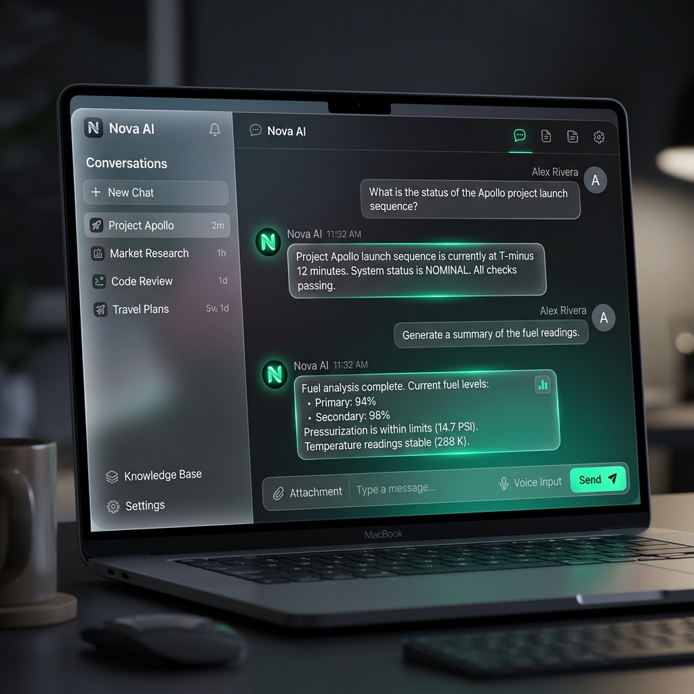

# SimSit AI

🚀 **Live Demo**: [https://chatbot-simsit.onrender.com/](https://chatbot-simsit.onrender.com/)

A premium, modern AI chatbot application built with Flask, OpenAI-compatible APIs (Groq), and a sleek glassmorphism frontend.

## Interface Preview



## 🚀 Free Deployment Guide

You can host **SimSit AI** for free using these platforms:

### 1. Render (Recommended)
- **Ease of use**: Very high.
- **Auto-deploy**: Pushes automatically when you update GitHub.
- **Setup**:
  - Connect GitHub.
  - Set Build Command: `pip install -r requirements.txt`
  - Set Start Command: `gunicorn app:app`
  - Add your `OPENAI_API_KEY` in the Environment tab.

### 2. Railway
- **Ease of use**: High.
- **Setup**:
  - Connect GitHub.
  - Railway will auto-detect the Flask app.
  - Add your Environment Variables in the "Variables" tab.

### 3. PythonAnywhere
- **Best for**: Permanent simple hosting.
- **Note**: Requires a slightly different setup for the WSGI file, but supports Flask perfectly.

---

## 🛠️ Features
- **Modern UI**: Dark mode with premium glassmorphism effects.
- **Fast Inference**: Powered by Groq and Llama 3.
- **Session Support**: Save and manage multiple chat histories.
- **Responsive**: Works on mobile and desktop.

## Setup Instructions

### 1. Prerequisites
- Python 3.8+
- An OpenAI API Key

### 2. Installation
Open your terminal in the project directory and run:

```powershell
# Create a virtual environment (optional but recommended)
python -m venv venv
.\venv\Scripts\activate

# Install dependencies
pip install -r requirements.txt
```

### 3. Configuration
Open the `.env` file and replace `your_openai_api_key_here` with your actual OpenAI API key.

```env
OPENAI_API_KEY=sk-...
FLASK_SECRET_KEY=any-random-string
```

### 4. Run Locally
```powershell
python app.py
```
The application will be available at `http://127.0.0.1:5000`.

## Project Structure
- `app.py`: Flask backend with streaming logic.
- `static/`: Frontend assets (CSS, JS).
- `templates/`: HTML templates.
- `.env`: API keys and secrets.
- `requirements.txt`: Python dependencies.

## Troubleshooting
- **API Key Error**: Ensure your API key is correct and has active credits.
- **CORS Errors**: The backend includes CORS support, but ensure you are accessing via the correct localhost URL.
- **Streaming Issues**: If streaming fails, check your network connection or API limits.
